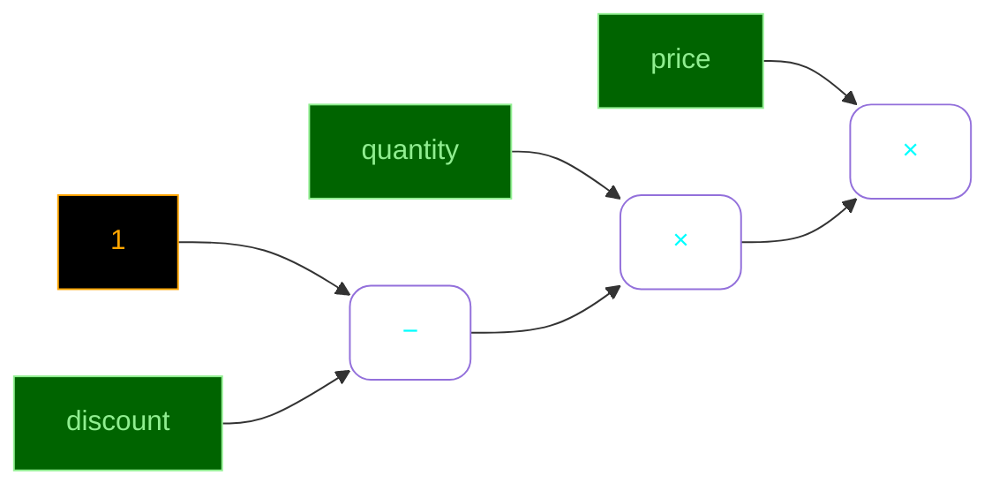
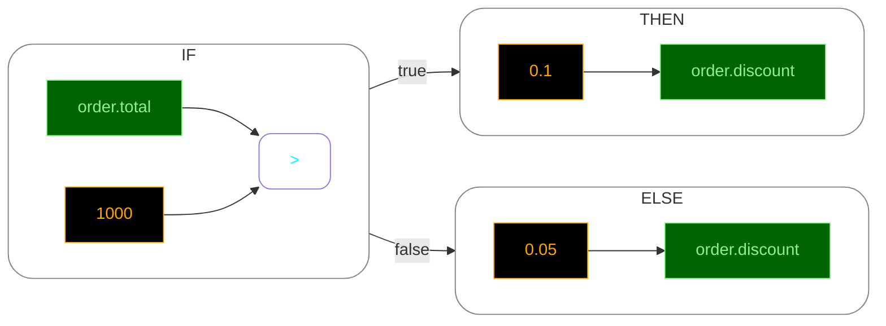

# Mermaid Renderer

`MermaidRenderer` turns a rule or expression into Mermaid flowchart syntax.

This is useful for architecture documents, rule reviews, generated docs, or debugging complex expressions visually.

Import it from the optional rendering entry point:

```ts
import { DefaultMermaidTheme, MermaidRenderer } from '@samatawy/rules/render';
```

## Basic usage

```ts
import { RuleParser, Workspace } from '@samatawy/rules';
import { DefaultMermaidTheme, MermaidRenderer } from '@samatawy/rules/render';

const space = new Workspace();
const parser = new RuleParser({ workspace: space });
const rule = parser.parse('IF total > 100 THEN discount = 0.1');

const renderer = new MermaidRenderer();
renderer.setStyles(DefaultMermaidTheme.styles());

const graph = renderer.render(rule);
```

If you render a rule, the output starts with a Mermaid `flowchart` declaration and includes `IF`, `THEN`, `ELSE`, or `SET` subgraphs where relevant.

If you render only an expression, the output starts with `graph` and focuses on the expression tree.

## Layout

The renderer supports Mermaid's common directional layouts:

- `LR` for left-to-right
- `RL` for right-to-left
- `TD` for top-down
- `BT` for bottom-up

Example:

```ts
const renderer = new MermaidRenderer();
renderer.setLayout('TD');
renderer.setStyles(DefaultMermaidTheme.styles());
```

`LR` is the default.

## Theme and styling

Unlike the HTML renderer, Mermaid styling is always emitted as Mermaid `classDef` statements. That means `setStyle()` and `setStyles()` affect the rendered graph text directly.

Example customization:

```ts
const renderer = new MermaidRenderer();
renderer.setStyles(DefaultMermaidTheme.styles());
renderer.setStyle('variable', {
  fill: 'darkgreen',
  color: 'white',
  stroke: 'lightgreen',
});
renderer.setStyle('block', {
  fill: 'transparent',
  stroke: 'slategray',
  rx: '16',
  ry: '16',
});
```

Supported Mermaid style properties are:

- `color`
- `rx`
- `ry`
- `fill`
- `stroke`
- `stroke-width`
- `opacity`
- `font-size`
- `font-weight`
- `font-style`
- `font-family`

`DefaultMermaidTheme.styles()` provides a ready-made theme for the built-in element types such as variables, literals, functions, operators, commands, and grouped blocks.

## Examples

### Expression

The expression `price * quantity * (1 - discount)` is parsed and rendered as a graph where operator nodes pull from their operand nodes:

```ts
import { ExpressionParser, Workspace } from '@samatawy/rules';
import { DefaultMermaidTheme, MermaidRenderer } from '@samatawy/rules/render';

const space = new Workspace();
const ep = new ExpressionParser({ workspace: space });
const expr = ep.parse('price * quantity * (1 - discount)');

const renderer = new MermaidRenderer();
renderer.setStyles(DefaultMermaidTheme.styles());

const graph = renderer.render(expr);
```

The resulting graph:



---

### IF-THEN-ELSE rule

The rule `IF order.total > 1000 THEN order.discount = 0.10 ELSE order.discount = 0.05` renders as a flowchart with `IF`, `THEN`, and `ELSE` subgraphs:

```ts
import { RuleParser, Workspace } from '@samatawy/rules';
import { DefaultMermaidTheme, MermaidRenderer } from '@samatawy/rules/render';

const space = new Workspace();
const rp = new RuleParser({ workspace: space });
const rule = rp.parse('IF order.total > 1000 THEN order.discount = 0.10 ELSE order.discount = 0.05');

const renderer = new MermaidRenderer();
renderer.setStyles(DefaultMermaidTheme.styles());

const graph = renderer.render(rule);
```

The resulting graph:



---

## How structure is rendered

- Binary expressions place the operator in a node and connect the left and right operands into it.
- Function calls render as function nodes with edges from each argument.
- Lambda-based array functions keep the lambda visually attached to the source array.
- Ternaries and switch expressions render as grouped subgraphs.
- Commands render as command nodes with labeled edges for each named argument.
- Rule-level `IF`, `THEN`, `ELSE`, and `SET` sections become Mermaid subgraphs.

The `block` style is applied to grouped rule sections and grouped expression containers such as ternaries and switches.

## Practical notes

- The renderer keeps an internal node map so repeated traversal of the same render tree produces connected nodes instead of disconnected labels.
- Mermaid output is text, so you can store it, diff it, or post-process it before display.
- Because the output is based on `toJson()`, a custom Mermaid theme can be swapped in without changing any parsing or evaluation logic.