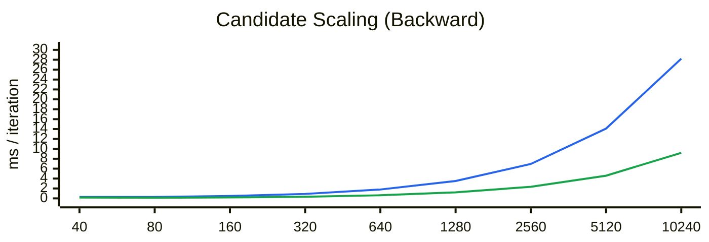
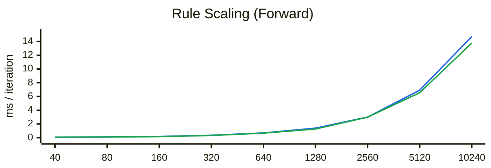
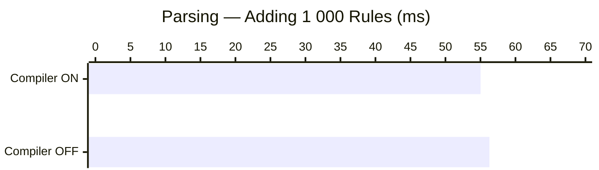
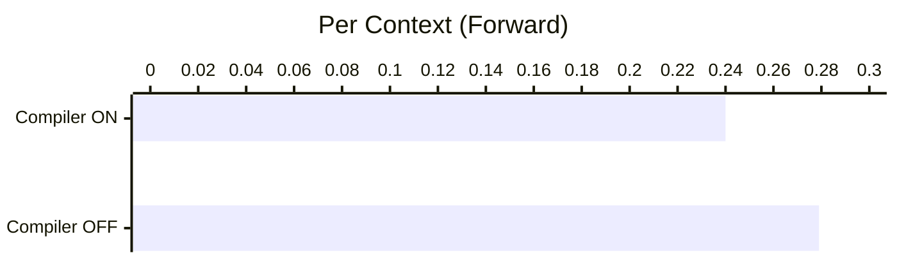
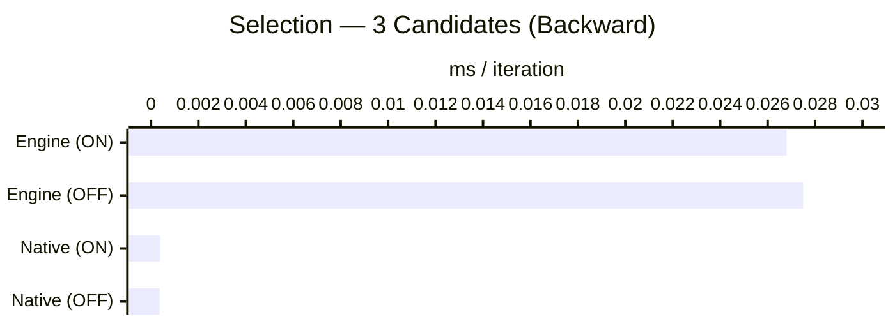
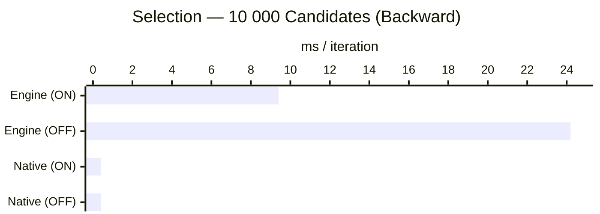
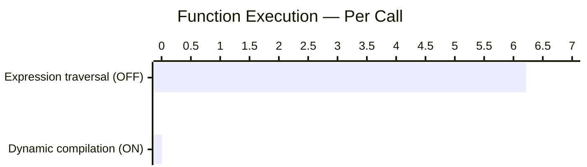
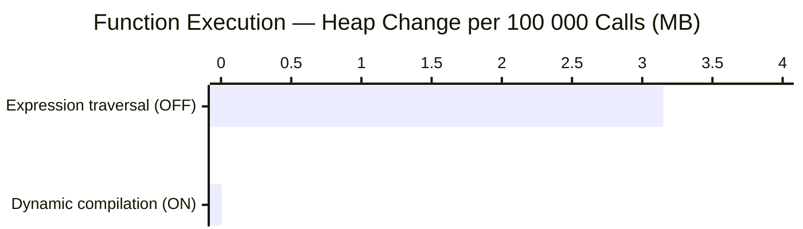

# Performance

This page describes the performance characteristics of the rule engine across its two operational phases, two execution modes, and two implementation strategies.

All figures below are measured on a single machine (M1 Pro MBP). Use them as relative guidance rather than absolute targets — hardware, V8 JIT state, and rule complexity will all shift the absolute numbers.

---

## Overview

Engine operation divides into two phases:

- **Parsing** loads rules and function declarations into a workspace. This is usually a one-time startup cost.
- **Execution** processes contexts against the loaded rules. This is the repeated request-time cost.

Within execution there are two modes (through different requests):

- **Forward chaining** iteratively evaluates all applicable rules until no further changes occur.
- **Backward chaining** is goal-directed and evaluates only the rules needed to derive a requested output.

Within execution there are two implementation strategies:

- **Dynamic compilation** compiles rules and functions to native JavaScript at load time using `FunctionCompiler.enabled = true`.
- **Expression traversal** evaluates rules and functions by walking the parsed expression tree at run time.

---

## Scalability Under Load

The measurements below show the main scaling behavior first, before the single-scenario comparisons later in this page.

> These Mermaid charts compare sampled doubling steps as categories. The even spacing is a good fit for comparative checkpoints, but it still does not represent a geometrically exact numeric x-axis.

### Backward Chaining Scalability — Candidate Count

These measurements use a backward-chaining request and vary only the candidate pool size. The charts below show per-iteration time, while the table keeps both time and heap-change reference values.

| Candidates | Compiler OFF per iteration | Compiler OFF heap | Compiler ON per iteration | Compiler ON heap | Speedup |
| --- | --- | --- | --- | --- | --- |
| 40 | 0.271 ms | +1.40 MB | 0.182 ms | +0.62 MB | 1.5× |
| 80 | 0.272 ms | +2.50 MB | 0.129 ms | +6.14 MB | 2.1× |
| 160 | 0.468 ms | −4.04 MB | 0.196 ms | −7.25 MB | 2.4× |
| 320 | 0.896 ms | +3.41 MB | 0.323 ms | +7.09 MB | 2.8× |
| 640 | 1.786 ms | −3.97 MB | 0.623 ms | −5.26 MB | 2.9× |
| 1 280 | 3.509 ms | +4.97 MB | 1.210 ms | +3.38 MB | 2.9× |
| 2 560 | 6.946 ms | +8.87 MB | 2.339 ms | +3.75 MB | 3.0× |
| 5 120 | 14.094 ms | +0.67 MB | 4.579 ms | +4.65 MB | 3.1× |
| 10 240 | 28.217 ms | +10.78 MB | 9.203 ms | +5.73 MB | 3.1× |

Blue line = **Compiler OFF**. Green line = **Compiler ON**.

Time growth is close to linear in candidate count for both modes, which is what you want in a selector workload. In the combined line view the separation between the two series is easier to read: the compiler advantage rises from about **1.5×** at 40 candidates to roughly **3×** once the pool reaches a few thousand candidates.

Heap change is included in the comparison table for reference, but not charted here because garbage collection timing dominates the sign and size of short-run allocation deltas.

### Forward Chaining Scalability — Rule Count

These measurements use a forward-chaining request and vary only the number of loaded rules. The charts below show per-iteration time, while the table keeps both time and heap-change reference values.

| Rules | Compiler OFF per iteration | Compiler OFF heap | Compiler ON per iteration | Compiler ON heap | Speedup |
| --- | --- | --- | --- | --- | --- |
| 40 | 0.081 ms | +6.26 MB | 0.080 ms | +7.18 MB | 1.0× |
| 80 | 0.107 ms | +7.12 MB | 0.098 ms | +7.19 MB | 1.1× |
| 160 | 0.177 ms | +13.09 MB | 0.162 ms | +13.06 MB | 1.1× |
| 320 | 0.354 ms | −4.56 MB | 0.328 ms | −3.97 MB | 1.1× |
| 640 | 0.686 ms | +4.57 MB | 0.664 ms | +5.88 MB | 1.0× |
| 1 280 | 1.393 ms | +6.04 MB | 1.267 ms | +5.60 MB | 1.1× |
| 2 560 | 2.999 ms | +5.15 MB | 2.993 ms | +21.47 MB | 1.0× |
| 5 120 | 6.920 ms | +18.43 MB | 6.550 ms | +6.81 MB | 1.1× |
| 10 240 | 14.707 ms | +69.85 MB | 13.780 ms | +17.72 MB | 1.1× |

Blue line = **Compiler OFF**. Green line = **Compiler ON**.

Engine performance scales roughly linearly with rule count. Unlike scaling with data load, the compiler advantage stays modest and fairly flat at around **1.0× to 1.1×**. That suggests the dominant cost when scaling rules is not only expression evaluation, but also rule scheduling, context mutation, conflict handling, and repeated iteration through the active rule set.

**Takeaway:**

- Large workloads benefit strongly and consistently from compilation as load grows.
- Large rule sets scale acceptably with rule count, but compilation delivers only modest end-to-end gains across the measured range.

---

## Phase 1: Parsing

Parsing is the one-time cost of loading rules into a workspace. The difference between compiler-on and compiler-off at this stage is small: both paths perform the same tokenising, AST construction, and type resolution. The compiler adds a one-time code-generation step per function, whose cost is quickly amortised over executions.

| Metric | Compiler ON | Compiler OFF |
| --- | --- | --- |
| Adding 1 000 rules | 55.0 ms | 56.3 ms |
| Heap change | +2.8 MB | +4.8 MB |

The compiler allocates less heap during parsing because it converts expression trees into compact native functions; the AST nodes can then be released sooner.

**Takeaway:** Parsing time is not meaningfully affected by the compiler flag. Optimise for parse cost by loading rules once at startup rather than per request.

---

## Phase 2: Execution

### Forward Chaining

Forward chaining processes a context through the full loaded rule set, iterating until the context reaches a stable state.

The following measurements use 1 000 contexts processed against 2 000 loaded rules:

| Metric | Compiler ON | Compiler OFF |
| --- | --- | --- |
| 1 000 runs total | 239.7 ms | 278.5 ms |
| Per context | 0.240 ms | 0.279 ms |
| Heap change | −1.5 MB | +0.6 MB |

The compiler eliminates intermediate expression-node allocations during evaluation, which is why the heap actually shrinks slightly (prior GC pressure from parsing is released) when the compiler is on.

**Takeaway:** The compiler gives roughly a 14 % throughput improvement and removes ephemeral heap pressure in high-volume forward-chaining workloads.

---

### Backward Chaining — Candidate Selection

Two implementations are compared:

- **Engine (workspace functions):** scoring logic is declared in the rules DSL and evaluated through the engine's backward-chaining path.
- **Native TypeScript:** equivalent logic written as plain TypeScript array functions, bypassing the engine entirely.

#### Small Pool (3 candidates, 10 000 runs)

| Implementation | Compiler ON | Compiler OFF | Per run |
| --- | --- | --- | --- |
| Engine | 268.3 ms | 275.1 ms | ~0.027 ms |
| Native TypeScript | 3.9 ms | 3.7 ms | ~0.0004 ms |

For small pools the compiler makes little practical difference because the per-run overhead is dominated by workspace bookkeeping rather than expression evaluation. The engine path is roughly 70× slower than native at this pool size.

#### Large Pool (10 000 candidates, 100 runs)

| Implementation | Compiler ON | Compiler OFF | Per run |
| --- | --- | --- | --- |
| Engine | 939.9 ms | 2 419.4 ms | 9.4 ms (ON) / 24.2 ms (OFF) |
| Native TypeScript | 39.8 ms | 39.3 ms | ~0.40 ms |

At large pool sizes the compiler delivers a **2.6× speedup** (939 ms vs 2 419 ms). This is where dynamic compilation pays back its loading cost most clearly. Native TypeScript remains ~24× faster than the compiled engine path and ~62× faster than the expression-traversal (compiler OFF) path.

**Peak memory during large-pool selection:**

| | Initial | Peak | Final | After GC |
| --- | --- | --- | --- | --- |
| Engine, compiler ON | 19.95 MB | 36.87 MB | 22.18 MB | 19.83 MB |
| Engine, compiler OFF | 19.71 MB | 36.06 MB | 24.61 MB | 19.71 MB |
| Native, compiler ON | 19.83 MB | 34.25 MB | 30.50 MB | 19.95 MB |
| Native, compiler OFF | 19.71 MB | 34.14 MB | 30.39 MB | 19.83 MB |

Peak memory is similar across all four configurations (~34–37 MB). The engine path returns near its starting footprint after a GC cycle. The native path retains more post-run heap because of closures captured in the lambda functions; it also recovers to baseline after a full GC.

---

## Implementation Strategy: Compiled vs Expression Traversal

The compiler flag selects between two mutually exclusive execution strategies for DSL functions:

- **Compiler OFF** — the engine walks the parsed expression tree at call time (expression traversal).
- **Compiler ON** — the engine calls a native JavaScript function generated once at load time. No traversal occurs.

| Strategy | 100 000 calls | Per call | Heap change |
| --- | --- | --- | --- |
| Expression traversal (compiler OFF) | 621.8 ms | ~6.2 μs | +3.15 MB |
| Dynamic compilation (compiler ON) | 0.622 ms | ~6.2 ns | +5 KB |

The compiled path is approximately **1 000× faster per call** and produces negligible heap churn. Expression traversal allocates node-level objects on each evaluation, producing several megabytes of short-lived heap pressure per 100 000 calls.

> A separate baseline measurement ran the traversal path alongside compiled functions in the same process and recorded 488.6 ms for 100 000 traversal calls. The ~21 % difference versus the 621.8 ms standalone figure likely reflects V8 JIT warmup from the compiled path benefiting surrounding interpreted code.

---

## Guidance

The choice between forward and backward chaining is primarily a business and modelling decision, not a pure performance decision. The guidance below focuses on when the compiler is likely to help, once that execution mode has already been chosen for functional reasons.

### When to enable the compiler

- Function-heavy rules called thousands of times per request or more
- Large candidate pools or other workloads (>1 000 candidates or items)
- Production deployments where per-call latency or throughput matters
- Background batch scoring jobs

### When to keep the compiler off

- Rule development, authoring, and testing — traversal gives full expression-level introspection, step-through rendering, and readable error context
- Rules loaded and discarded frequently (e.g. per-request workspaces) where compilation cost is not amortised
- Small, infrequently run rule sets where the difference is negligible

### Replacing native logic with engine rules

The engine path adds overhead compared with equivalent native TypeScript. Use the figures below as a rough guide:

| Pool size | Engine vs native overhead (compiler ON) |
| --- | --- |
| 3 candidates | ~68× |
| 10 000 candidates | ~24× |

This overhead is the trade-off for declarative, auditable, type-checked rules that can be changed without redeploying application code. For the scenarios where the engine is the right tool, it is fast enough; for pure algorithmic throughput where no rule-level auditability is needed, native TypeScript will always win.
