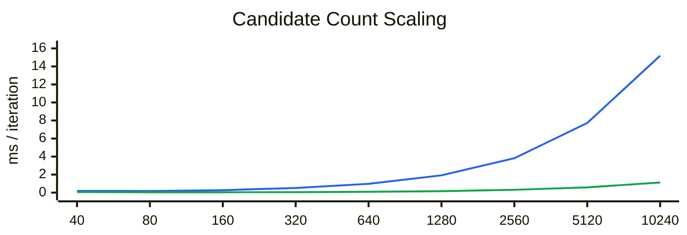
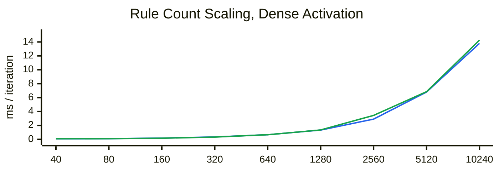
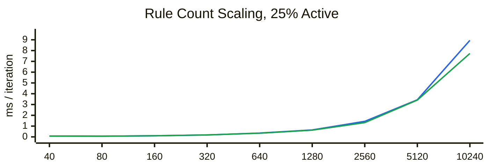
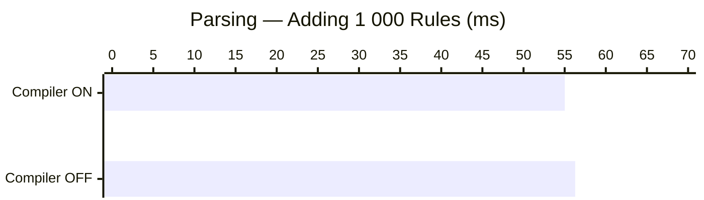
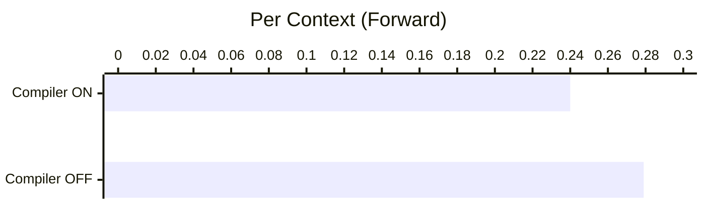
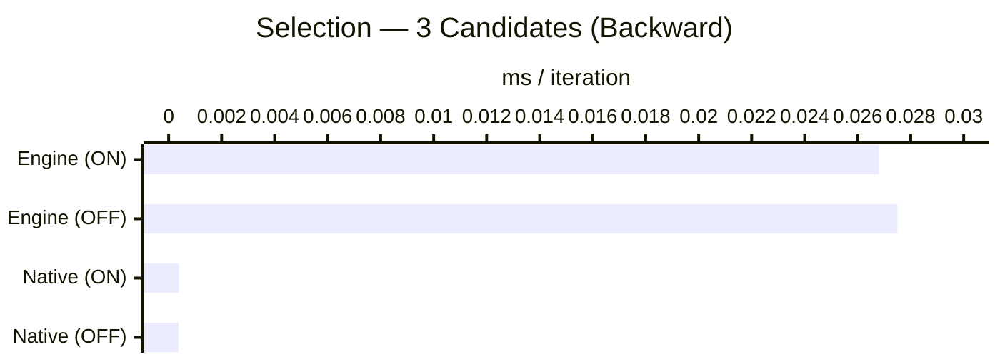
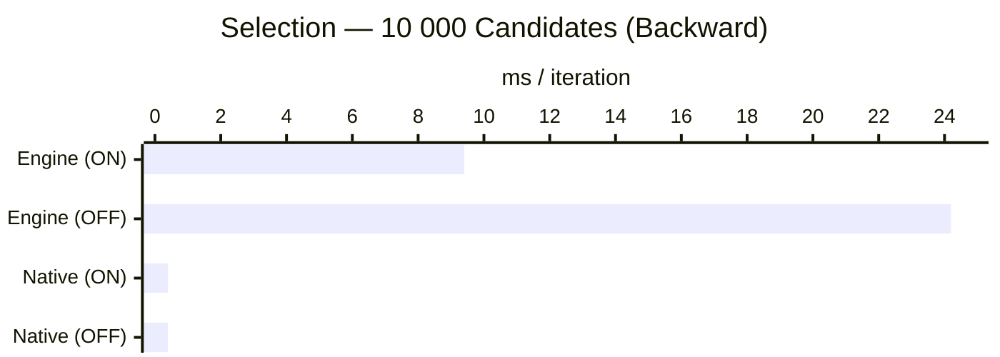
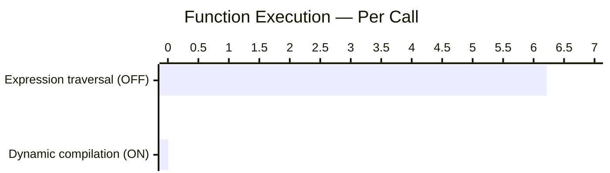
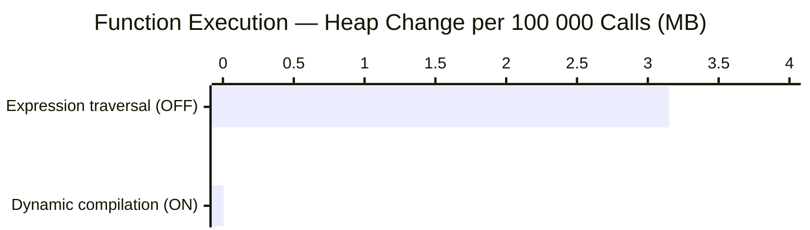

# Performance

This page describes the performance characteristics of the rule engine across its two operational phases, two execution modes, and two implementation strategies.

All figures below are measured on a single machine (M1 Pro MBP). Use them as relative guidance rather than absolute targets — hardware, V8 JIT state, and rule complexity will all shift the absolute numbers.

---

## Overview

Engine operation divides into two phases:

- **Parsing** loads rules and function declarations into a workspace. This is usually a one-time startup cost.
- **Execution** processes contexts against the loaded rules. This is the repeated request-time cost.

Within execution there are two modes (through different requests):

- **Forward chaining** iteratively evaluates all applicable rules until no further changes occur.
- **Backward chaining** is goal-directed and evaluates only the rules needed to derive a requested output.

Within execution there are two implementation strategies:

- **Dynamic compilation** compiles rules and functions to native JavaScript at load time using `FunctionCompiler.enabled = true`.
- **Expression traversal** evaluates rules and functions by walking the parsed expression tree at run time.

---

## Scalability Under Load

The measurements below show the main scaling behavior first, before the single-scenario comparisons later in this page.

> These Mermaid charts compare sampled doubling steps as categories. The even spacing is a good fit for comparative checkpoints, but it still does not represent a geometrically exact numeric x-axis.

### Data-Load Scaling — Candidate Count

These measurements use a backward-chaining request and vary only the candidate pool size. The charts below show per-iteration time, while the table keeps both time and heap-change reference values.

| Candidates | Compiler OFF per iteration | Compiler OFF heap | Compiler ON per iteration | Compiler ON heap | Relative speed (OFF/ON) |
| --- | --- | --- | --- | --- | --- |
| 40 | 0.192 ms | −0.54 MB | 0.070 ms | −1.81 MB | 2.7× |
| 80 | 0.176 ms | +0.53 MB | 0.039 ms | +4.31 MB | 4.5× |
| 160 | 0.270 ms | +1.48 MB | 0.041 ms | −2.21 MB | 6.6× |
| 320 | 0.508 ms | +2.96 MB | 0.053 ms | +0.78 MB | 9.6× |
| 640 | 0.978 ms | +3.38 MB | 0.089 ms | −1.03 MB | 11.0× |
| 1 280 | 1.919 ms | +2.72 MB | 0.161 ms | +3.81 MB | 11.9× |
| 2 560 | 3.816 ms | +4.45 MB | 0.315 ms | −3.68 MB | 12.1× |
| 5 120 | 7.725 ms | +8.02 MB | 0.583 ms | +6.66 MB | 13.2× |
| 10 240 | 15.194 ms | +4.21 MB | 1.122 ms | −6.08 MB | 13.5× |

Blue line = **Compiler OFF**. Green line = **Compiler ON**.

Time growth is close to linear in candidate count for both modes, which is what you want in a selector workload. In this latest run the compiler is dramatically faster, and the gap widens as the pool grows: it starts around **2.7×** at 40 candidates and grows to roughly **13×** by 10 240 candidates.

Heap change is included in the comparison table for reference, but not charted here because garbage collection timing dominates the sign and size of short-run allocation deltas.

### Rule-Count Scaling — Dense Activation

These measurements use a forward-chaining request and vary only the number of loaded rules. The charts below show per-iteration time, while the table keeps both time and heap-change reference values.

| Rules | Compiler OFF per iteration | Compiler OFF heap | Compiler ON per iteration | Compiler ON heap | Relative speed (OFF/ON) |
| --- | --- | --- | --- | --- | --- |
| 40 | 0.074 ms | +5.94 MB | 0.083 ms | +7.17 MB | 0.9× |
| 80 | 0.100 ms | −9.28 MB | 0.098 ms | +7.18 MB | 1.0× |
| 160 | 0.181 ms | −2.83 MB | 0.163 ms | +13.12 MB | 1.1× |
| 320 | 0.348 ms | −4.77 MB | 0.327 ms | −4.20 MB | 1.1× |
| 640 | 0.664 ms | +3.41 MB | 0.663 ms | +5.26 MB | 1.0× |
| 1 280 | 1.337 ms | −8.29 MB | 1.352 ms | +5.60 MB | 1.0× |
| 2 560 | 2.908 ms | +3.46 MB | 3.442 ms | +19.64 MB | 0.8× |
| 5 120 | 6.801 ms | +27.95 MB | 6.853 ms | −5.49 MB | 1.0× |
| 10 240 | 13.798 ms | +34.56 MB | 14.261 ms | −18.72 MB | 1.0× |

Blue line = **Compiler OFF**. Green line = **Compiler ON**.

Engine performance still scales roughly linearly with rule count. In this denser benchmark the two modes are effectively near parity across most of the range, with small wins alternating between them. That suggests the dominant cost when many rules remain active is not only expression evaluation, but also rule scheduling, context mutation, conflict handling, and repeated iteration through the active rule set.

### Rule-Count Scaling — Selective Activation

The following benchmark models a more common production shape where only about 25% of loaded rules are selected and executed on a given request. That is where the engine's rule-selection strategy has more room to help.

| Rules | Compiler OFF per iteration | Compiler OFF heap | Compiler ON per iteration | Compiler ON heap | Relative speed (OFF/ON) |
| --- | --- | --- | --- | --- | --- |
| 40 | 0.068 ms | +6.59 MB | 0.074 ms | -9.30 MB | 0.9x |
| 80 | 0.067 ms | -6.72 MB | 0.064 ms | +9.80 MB | 1.1x |
| 160 | 0.103 ms | +0.36 MB | 0.105 ms | +0.17 MB | 1.0x |
| 320 | 0.180 ms | -2.00 MB | 0.182 ms | -1.46 MB | 1.0x |
| 640 | 0.357 ms | -7.78 MB | 0.340 ms | -5.50 MB | 1.0x |
| 1 280 | 0.646 ms | +6.18 MB | 0.623 ms | +10.06 MB | 1.0x |
| 2 560 | 1.440 ms | -4.84 MB | 1.326 ms | -10.91 MB | 1.1x |
| 5 120 | 3.441 ms | +4.63 MB | 3.415 ms | +9.28 MB | 1.0x |
| 10 240 | 8.947 ms | +11.48 MB | 7.733 ms | +13.92 MB | 1.2x |

Blue line = **Compiler OFF**. Green line = **Compiler ON**.

This selective-activation scenario scales better than the denser benchmark above, especially at larger rule counts. That is consistent with the expectation that rule selection and Rete-style discrimination help most when many loaded rules are irrelevant to a particular request. In this case the effect is more visible in forward-chaining requests, because selective rule activation reduces the amount of work done across the active rule set. The compiler effect is still smaller than in data-load scaling, but the compiled path regains a modest edge at larger rule counts.

**Takeaway:**

- Large candidate-pool workloads benefit very strongly from compilation in this run, with the advantage widening from roughly **2.7×** to **13.5×** as load grows.
- Large rule sets still scale acceptably with rule count. In dense activation the two modes are close to parity, while in the more selective 25%-active scenario the engine benefits more from rule selection and the compiled path regains a modest advantage at larger scales.

---

## Phase 1: Parsing

Parsing is the one-time cost of loading rules into a workspace. The difference between compiler-on and compiler-off at this stage is small: both paths perform the same tokenising, AST construction, and type resolution. The compiler adds a one-time code-generation step per function, whose cost is quickly amortised over executions.

| Metric | Compiler ON | Compiler OFF |
| --- | --- | --- |
| Adding 1 000 rules | 55.0 ms | 56.3 ms |
| Heap change | +2.8 MB | +4.8 MB |

The compiler allocates less heap during parsing because it converts expression trees into compact native functions; the AST nodes can then be released sooner.

**Takeaway:** Parsing time is not meaningfully affected by the compiler flag. Optimise for parse cost by loading rules once at startup rather than per request.

---

## Phase 2: Execution

### Forward Chaining

Forward chaining processes a context through the full loaded rule set, iterating until the context reaches a stable state.

The following measurements use 1 000 contexts processed against 2 000 loaded rules:

| Metric | Compiler ON | Compiler OFF |
| --- | --- | --- |
| 1 000 runs total | 239.7 ms | 278.5 ms |
| Per context | 0.240 ms | 0.279 ms |
| Heap change | −1.5 MB | +0.6 MB |

The compiler eliminates intermediate expression-node allocations during evaluation, which is why the heap actually shrinks slightly (prior GC pressure from parsing is released) when the compiler is on.

**Takeaway:** The compiler gives roughly a 14 % throughput improvement and removes ephemeral heap pressure in high-volume forward-chaining workloads.

---

### Backward Chaining — Candidate Selection

Two implementations are compared:

- **Engine (workspace functions):** scoring logic is declared in the rules DSL and evaluated through the engine's backward-chaining path.
- **Native TypeScript:** equivalent logic written as plain TypeScript array functions, bypassing the engine entirely.

#### Small Pool (3 candidates, 10 000 runs)

| Implementation | Compiler ON | Compiler OFF | Per run |
| --- | --- | --- | --- |
| Engine | 268.3 ms | 275.1 ms | ~0.027 ms |
| Native TypeScript | 3.9 ms | 3.7 ms | ~0.0004 ms |

For small pools the compiler makes little practical difference because the per-run overhead is dominated by workspace bookkeeping rather than expression evaluation. The engine path is roughly 70× slower than native at this pool size.

#### Large Pool (10 000 candidates, 100 runs)

| Implementation | Compiler ON | Compiler OFF | Per run |
| --- | --- | --- | --- |
| Engine | 939.9 ms | 2 419.4 ms | 9.4 ms (ON) / 24.2 ms (OFF) |
| Native TypeScript | 39.8 ms | 39.3 ms | ~0.40 ms |

At large pool sizes the compiler delivers a **2.6× speedup** (939 ms vs 2 419 ms). This is where dynamic compilation pays back its loading cost most clearly. Native TypeScript remains ~24× faster than the compiled engine path and ~62× faster than the expression-traversal (compiler OFF) path.

**Peak memory during large-pool selection:**

| | Initial | Peak | Final | After GC |
| --- | --- | --- | --- | --- |
| Engine, compiler ON | 19.95 MB | 36.87 MB | 22.18 MB | 19.83 MB |
| Engine, compiler OFF | 19.71 MB | 36.06 MB | 24.61 MB | 19.71 MB |
| Native, compiler ON | 19.83 MB | 34.25 MB | 30.50 MB | 19.95 MB |
| Native, compiler OFF | 19.71 MB | 34.14 MB | 30.39 MB | 19.83 MB |

Peak memory is similar across all four configurations (~34–37 MB). The engine path returns near its starting footprint after a GC cycle. The native path retains more post-run heap because of closures captured in the lambda functions; it also recovers to baseline after a full GC.

---

## Implementation Strategy: Compiled vs Expression Traversal

The compiler flag selects between two mutually exclusive execution strategies for DSL functions:

- **Compiler OFF** — the engine walks the parsed expression tree at call time (expression traversal).
- **Compiler ON** — the engine calls a native JavaScript function generated once at load time. No traversal occurs.

| Strategy | 100 000 calls | Per call | Heap change |
| --- | --- | --- | --- |
| Expression traversal (compiler OFF) | 621.8 ms | ~6.2 μs | +3.15 MB |
| Dynamic compilation (compiler ON) | 0.622 ms | ~6.2 ns | +5 KB |

The compiled path is approximately **1 000× faster per call** and produces negligible heap churn. Expression traversal allocates node-level objects on each evaluation, producing several megabytes of short-lived heap pressure per 100 000 calls.

> A separate baseline measurement ran the traversal path alongside compiled functions in the same process and recorded 488.6 ms for 100 000 traversal calls. The ~21 % difference versus the 621.8 ms standalone figure likely reflects V8 JIT warmup from the compiled path benefiting surrounding interpreted code.

---

## Guidance

The choice between forward and backward chaining is primarily a business and modelling decision, not a pure performance decision. The guidance below focuses on when the compiler is likely to help, once that execution mode has already been chosen for functional reasons.

### When to enable the compiler

- Function-heavy rules called thousands of times per request or more
- Large candidate pools or other workloads (>1 000 candidates or items)
- Production deployments where per-call latency or throughput matters
- Background batch scoring jobs

### When to keep the compiler off

- Rule development, authoring, and testing — traversal gives full expression-level introspection, step-through rendering, and readable error context
- Rules loaded and discarded frequently (e.g. per-request workspaces) where compilation cost is not amortised
- Small, infrequently run rule sets where the difference is negligible

### Replacing native logic with engine rules

The engine path adds overhead compared with equivalent native TypeScript. Use the figures below as a rough guide:

| Pool size | Engine vs native overhead (compiler ON) |
| --- | --- |
| 3 candidates | ~68× |
| 10 000 candidates | ~24× |

This overhead is the trade-off for declarative, auditable, type-checked rules that can be changed without redeploying application code. For the scenarios where the engine is the right tool, it is fast enough; for pure algorithmic throughput where no rule-level auditability is needed, native TypeScript will always win.
